<!-- ============================================================= -->
<!--   PARALLAX ANIMATED HEADER                                     -->
<!--   Host header.svg in your repo (e.g. ./assets/header.svg)      -->
<!--   then this  renders the drifting parallax layers.        -->
<!-- ============================================================= -->
<div align="center">



<!-- Typing tagline -->
<a href="https://www.prashantsingh.in/">
  
</a>

<br/>


<a href="https://github.com/prashant17d97?tab=followers">
  
</a>

</div>

<!-- Animated wave divider -->


## 🧑‍💻 About Me

```kotlin
val prashant = Engineer(
    role        = "Engineering Manager",
    foundation  = "Kotlin Multiplatform",
    nowBuilding = listOf("Go backends", "Next.js frontends", "AI-assisted tooling"),
    mindset     = "Builder at heart — secure, scalable, cross-platform",
)
```

- 🔭 I lead engineering by day and build products by night.
- 🌱 Currently going deep on **Go** and **agentic, multi-agent development workflows**.
- 💬 Ask me about **Kotlin Multiplatform**, **full-stack architecture**, or **shipping fast without breaking things**.
- ⚡ Fun fact: I love sharing a single codebase across **iOS, Android, Web, and Desktop**.

<!-- ============================================================= -->
<!--   ANIMATED CONTRIBUTION SNAKE                                  -->
<!--   Requires the snake GitHub Action (see snake.yml).            -->
<!--   It regenerates these SVGs on the 'output' branch.           -->
<!-- ============================================================= -->
<div align="center">

<picture>
  <source media="(prefers-color-scheme: dark)" srcset="https://raw.githubusercontent.com/prashant17d97/prashant17d97/output/github-snake-dark.svg" />
  <source media="(prefers-color-scheme: light)" srcset="https://raw.githubusercontent.com/prashant17d97/prashant17d97/output/github-snake.svg" />
  
</picture>

</div>


## 🔧 My Tech Toolbox

<div align="center">

<h3>🖥️ Languages</h3>


<h3>📱 Mobile & Cross-Platform</h3>


<h3>🌐 Web & Backend</h3>


<h3>🗄️ Data & Infra</h3>


<h3>☁️ Cloud & DevOps</h3>


<h3>🧰 Tooling & AI</h3>


</div>


## 📊 GitHub Stats

<div align="center">

<a href="https://github.com/prashant17d97">
  
</a>
<a href="https://github.com/prashant17d97">
  
</a>

<br/>

<a href="https://github.com/prashant17d97">
  
</a>

<br/>

<a href="https://github.com/prashant17d97">
  
</a>

</div>


## 🎯 What I'm Building

<table>
<tr>
<td width="50%" valign="top">

### 🔐 KMP Sign-In Library
A unified, cross-platform authentication solution.

- **Providers:** Google · Facebook · GitHub · Apple · Twitter · LinkedIn · Microsoft Entra
- **Standards:** OAuth 2.0 · OpenID Connect
- **Security:** PKCE + token-based auth
- **Native:** iOS & Android shipped, Desktop & Web in progress
- **Extensible:** Drop in a new provider with minimal code

</td>
<td width="50%" valign="top">

### 🚀 Full-Stack Product Work
Building production systems end to end.

- **Backend:** Go (chi · sqlc · goose · River · Redis)
- **Frontend:** Next.js (TanStack Query · Zustand · nuqs · Tailwind)
- **Cross-platform:** Privacy-first KMP apps — zero-knowledge expense tracking & secure storage
- **Workflow:** Multi-agent development with Claude Code & `CLAUDE.md` governance

</td>
</tr>
</table>


## 📈 Activity Graph

<div align="center">

<a href="https://github.com/prashant17d97">
  
</a>

</div>


## 📫 Let's Connect!

<div align="center">

<a href="mailto:prashantsinghsca@gmail.com">
  
</a>
<a href="https://www.linkedin.com/in/prashant-android-dev/">
  
</a>
<a href="https://www.prashantsingh.in/">
  
</a>

<br/><br/>

<h3>💡 Quote I Build By</h3>

<a href="https://github.com/piyushsuthar/github-readme-quotes">
  
</a>

</div>

<!-- Animated waving footer -->

